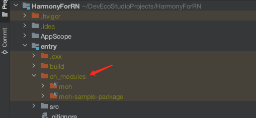

这是一个鸿蒙 Demo
1. 展示鸿蒙接入 RN 的步骤
2. 鸿蒙 & RN 基础开发与测试


2024-03-28

- 鸿蒙相关开发是白名单机制, 有保密需求, 因此相关文档, SDK 均不上传 github
- 对 RN 的支持严格要求 RN 版本, 三方工具版本, IDE 版本
- [RNForHarmony Demo](https://github.com/HeCaser/RNForHarmony)

## 环境
- DevEco Studio Version: 4.1.3.50
- 工程配置信息


## 接入 & 加载

### 加载 har 包
> rnoh 是鸿蒙支持 RN 所需要的工具

- 在工程根目录下新建 libs 文件夹，把 rnoh-4.1.0.300.har 和 sample_package-4.1.0.300.har 放入
  该目录。


- 解压鸿蒙提供的工程, 取其中 `cpp` `ets` `*.json5` 等文件替换当前项目文件

- 通过 `File > Sync and Refresh Project` 来执行 `ohpm install` 命令. 执行完成后会在 entry 目录下生成 `oh_modules` 文件夹



备注: 由于 rnoh 包比较大，这一步耗时会比较长，务必保证 ohpm install 和 IDE 自发的 sync Data
全都完成，否则会导致编译报错。

### 加载本地 bundle 包
- 将 [RNForHarmony Demo](https://github.com/HeCaser/RNForHarmony) 中生成的 bundle 和 assets 文件放置在当前项目的 `entry/src/main/resources/rawfile` 目录下

- 修改 `src/main/ets/pages/Index.ets` 文件, 加载 RN Bundle

```ts
@Entry
@Component
struct Index {
  @StorageLink('RNAbility') rnAbility: RNAbility | undefined = undefined
  @State shouldShow: boolean = false

  onBackPress(): boolean | undefined {
    return this.rnAbility?.onBackPress();
  }

  build() {
    Column() {
      Button("点击加载 RN").onClick(()=>{
        this.shouldShow = true
      })
      if (this.rnAbility && this.shouldShow) {
        Text("RN页面")
        RNApp({
          rnInstanceConfig: { createRNPackages },
          appKey: "app_name", // RN 页面注册名称
          jsBundleProvider: new AnyJSBundleProvider([
            new ResourceJSBundleProvider(this.rnAbility.context.resourceManager, 'bundle.harmony.js')]), // 本地加载
        })
      } else {
        Text("原生页面")
      }

    }
    .height('100%')
    .width('100%')
    .padding({top:50})
  }
}

```

- RN 侧代码

```ts
AppRegistry.registerComponent('app_name', () => App);


import * as React from 'react';
import { Text, View, StyleSheet, Pressable } from 'react-native';//注入组件
const App = () => {
  return (
  ...
      <View style={styles.container}>
        <Text style={styles.title}>
          Hello World ~ RN
        </Text>
        <Text style={styles.content}>
          这里是 RN 开发的页面, 用一个 Text 展示文案
        </Text>
      </View>
   ...
  );
};
export default App;
const styles = StyleSheet.create({//创建样式
 ....
});
```

### 利用 Metro 服务加载 RN bundle 包

1. 安装 hdc 相关工具类 (已安装跳过此步骤)
    > Mac 电脑修改 .zshrc, 全局导出 HarmonyOS 相工具

    ```sh
    export PATH=${PATH}:/Users/hepan/Library/Huawei/Sdk/HarmonyOS-NEXT-DP1/base/toolchains
    HDC_SERVER_PORT=7035
    launchctl setenv HDC_SERVER_PORT $HDC_SERVER_PORT
    export HDC_SERVER_PORT
    ```

2. 在 [RNForHarmony](https://github.com/HeCaser/RNForHarmony) 根目录执行 `npm run start` 启动 Metro 服务

3. 连接真机, 执行 `hdc rport tcp:8081 tcp:8081` 命令

    

4. 修改 `src/main/ets/pages/Index.ets`  代码: 添加 `MetroJSBundleProvider`

    ```ts
    RNApp({
        ...
            appKey: "app_name",
            jsBundleProvider: new AnyJSBundleProvider([
            new MetroJSBundleProvider(), // 先尝试 Metro 加载, 加载失败会继续进行本地加载
        ...
        })
    ```

5. 重启手机即可加载 Metro 服务
   
   

6. 修改 RN 侧代码, 保存后发现代码立即生效了~

2024-03-29

## 初始化参数
> 鸿蒙加载 RN 页面时, 可以携带初始化参数到 RN 侧

- RN 页面获取参数
  
    ```ts
    // 与 Android, iOS 开发一样, 参数存放在构造方法中
    const InitParam = (prop: object) => {
        return (
            <View style={{ width: '100%', height: '100%', marginTop: 100, padding: 20}>
                <Text style={{ marginTop: 20 }}>
                    初始化参数:{JSON.stringify(prop)}
                </Text>
            </View>
        );
    };
    export default InitParam;
    ```

- 鸿蒙侧传递参数

    ```ts
    RNApp({
      ...
        initialProps:{"param":'init data from harmony'} as Record<string, string>,
      ...
    })
    ```

- RN 实际获得的参数是用户传递的参数 + SDK 补充的参数

    `{"param":"init data from harmony","concurrentRoot":true,"rootTag":1}`


2024-04-01

##  Bridge

RN 侧改动查看 [RNForHarmony-README](https://github.com/HeCaser/RNForHarmony)

鸿蒙侧改动

1. 实现与 RN 侧对应的类 `SampleTurboModule` 并实现相关方法 : [SampleTurboModule.ets](entry/src/main/ets/TurboModule/SampleTurboModule.ets)

2. 实现 `SampleTurboModulesFactory` 用于创建 `SampleTurboModule` : [SampleTurboModulePackage.ets](entry/src/main/ets/TurboModule/SampleTurboModulePackage.ets)

3. 将 `SampleTurboModulesFactory` 注入到 `RNPackagesFactory` , 在 RN 环境初始化时通过 `createRNPackages` 管理相关 Packages

运行双端代码, 发现 RN 侧调用方法时会遇到如下报错(找不到方法定义)


产生上述的原因是因为 TurboModule 需要通过 c++ 代码映射关联, facebook 提供了 Android iOS 端的代码自动生产工具 [codegen](https://github.com/reactwg/react-native-new-architecture/blob/main/docs/codegen.md), 鸿蒙侧可以复用 Android 平台相关 c++ 代码

鸿蒙侧 C 代码改动
> 因为自动生成逻辑没有跑通, 所以 c++ 代码还是用官方 Demo 提供的文件

这里只需要添加 Bridge 相关的文件, 无需 Demo 中 Fabric View 相关文件


添加两个文件 `SampleTurboModuleSpec.cpp` 和 `SampleTurboModuleSpec.h` 后需要在 `CMakeLists.txt` 中引入

```
add_library(rnoh_app SHARED
    "./PackageProvider.cpp"
    ...
    "./TurboModules/SampleTurboModuleSpec.cpp" // 引入
    ...
    "${RNOH_CPP_DIR}/RNOHAppNapiBridge.cpp"
)
```

c++ 文件配置完毕后, 再次运行 App, 成功. 